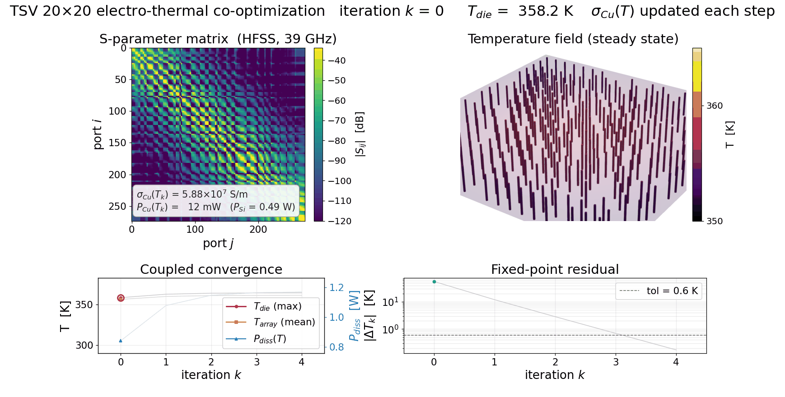

# Tessera

**A unified electro-thermo-optimization framework for through-silicon-via (TSV) networks.**

Tessera replaces slow full-wave EM + thermal solvers with a physics-informed
graph neural network (GNN) **surrogate**: given a TSV array's geometry,
signal/ground arrangement, temperature, and frequency, it predicts the full
complex **S-matrix** in milliseconds. That speed makes large multi-objective
**design-space exploration** — searching arrangements for low crosstalk,
insertion loss, and reflection under electro-thermal coupling — practical.

This repository accompanies our IEEE TCAD paper (see [Citation](#citation)) and
contains everything needed to **run the trained model** and **reproduce the
Optuna-based design-space exploration**. The trained weights are included.

<p align="center">
  
</p>

*Above: an electro-thermal co-optimization loop on a 20×20 TSV array — the
S-parameter matrix (top-left), the steady-state temperature field (top-right),
and the coupled convergence of die/array temperature and dissipated power
(bottom). The copper conductivity σ<sub>Cu</sub>(T) is updated each step until the
temperature residual falls below tolerance.*

---

## What's included

| Capability | Entry point |
|---|---|
| **Spec → S-matrix inference** | `tessera.predict_s_matrix(design)` · demo: `examples/predict_smatrix.py` |
| **Steady-state temperature** | `tessera.steady_state_temperature(design, p_per_tsv)` · demo: `examples/steady_state_temperature.py` |
| **Closed EM–thermal loop** | `tessera.electrothermal_loop(design)` · demo: `examples/electrothermal_loop.py` |
| **Ansys HFSS↔Mechanical sign-off** | `tessera.generate_signoff_script(design, out)` / `tessera.run_signoff(design)` · demo: `examples/signoff_generate.py` |
| **Optuna design-space exploration** | `python -m tessera.optimize` · demo: `examples/run_optimization.sh` |
| **Trained surrogate + scaler** | `models/best_model.pth`, `models/input_scaler.pt` |

The surrogate uses **7-D node features** `[Type, Radius, Pitch, Height, Liner,
Temperature, Freq]` with FiLM conditioning on the electro-thermal state
(frequency + temperature), a 4-layer graph transformer, and reciprocity-enforcing
dual output heads (node-level S21/S11, edge-level NEXT/FEXT). See the paper for
details.

## Installation

Requires Python ≥ 3.10. Install [PyTorch](https://pytorch.org/get-started/) for
your platform first (CPU is sufficient — a GPU only speeds up large batched
searches), then:

```bash
git clone https://github.com/HiPerCAS/tessera.git
cd tessera
pip install -e .
```

The S-parameter, thermal, closed-loop, and optimization features work with this
base install. The **Ansys sign-off** feature additionally needs PyAEDT and a
licensed Ansys AEDT 2026.1 installation:

```bash
pip install -e ".[signoff]"   # adds ansys-aedt-core (Ansys AEDT must be installed separately)
```

## Quickstart — predict an S-matrix

```python
import numpy as np
from tessera import predict_s_matrix

design = {
    "radius": 5e-6, "pitch": 60e-6, "height": 100e-6, "liner": 0.5e-6,  # metres
    "temperature": 300.0,   # K
    "freq": 15e9,           # Hz
    # +1 = signal via, -1 = ground via, 0 = empty cell
    "arrangement": np.array([[ 1, -1,  1],
                             [-1,  1, -1],
                             [ 1, -1,  1]], dtype=np.int8),
}

S = predict_s_matrix(design)     # complex ndarray, shape [2*n_signal, 2*n_signal]
print(S.shape)
```

Or run the full demo (prints metrics, saves `s_matrix.npy` and a dB heatmap):

```bash
python examples/predict_smatrix.py
```

To predict for many designs, load the model once and reuse it:

```python
from tessera import load_model, predict_s_matrix
model, scaler, device = load_model()
for d in designs:
    S = predict_s_matrix(d, model=model, scaler=scaler, device=device)
```

## Design-space exploration with Optuna

`tessera.optimize` runs an in-memory Optuna ask/tell loop (NSGA-II / TPE / QMC /
random) over signal/ground arrangements on a fixed-topology *G×G* grid, using the
surrogate as a millisecond objective oracle. It reports Pareto **hypervolume vs.
number of surrogate evaluations** and writes the final Pareto fronts and plots.

```bash
# small demo (2 grid sizes, 1 seed, 3k trials)
bash examples/run_optimization.sh

# or drive it directly
python -m tessera.optimize models/best_model.pth \
    --sizes 5 7 9 --samplers nsga2 random --seeds 0 1 2 --n-trials 100000
```

Objectives (all optimized simultaneously): maximize average S21 (transmission),
minimize worst-case S11 (reflection), NEXT and FEXT (near-/far-end crosstalk).
Fixed physical parameters for the search live under `optimization.fixed_params`
in `config.yaml`. Run `python -m tessera.optimize --help` for all options.

## Steady-state temperature

Turn a predicted S-matrix into a steady-state temperature field. The absorbed
per-TSV ohmic power (from the energy balance *P* = ‖*a*‖² − ‖*b*‖²) is deposited
into a 3-D anisotropic finite-volume solve on the **homogenised** substrate,
whose equivalent conductivities *K*ₓ, *K*ᵧ, *K*_z come analytically from
`tessera.thermal` — plus an optional die heat source and heatsink / convection
boundary conditions.

```python
import numpy as np
from tessera import load_model, predict_s_matrix, steady_state_temperature
from tessera.electrothermal import compute_per_tsv_power, project_to_passive

design = {
    "radius": 2e-6, "pitch": 25e-6, "height": 80e-6, "liner": 1.5e-6,
    "temperature": 300.0, "freq": 100e9,
    "arrangement": np.array([[1, 1, 1, 1], [1, 1, -1, 1],
                             [1, 1, 1, 1], [1, 1, 1, 1]], dtype=np.int8),
}
model, scaler, device = load_model()
S = predict_s_matrix(design, model=model, scaler=scaler, device=device)
S, _, _ = project_to_passive(S)                      # enforce singular values <= 1
p = compute_per_tsv_power(S, n_signals=15, excitation_mode="all_signal")

# Cooling boundary conditions (= the validated case, mirrored in config.yaml):
# a backside heatsink, weak top/side air convection, and a 50x50 um die.
# The temperature is only meaningful once you specify how the stack is cooled.
th = steady_state_temperature(
    design, p,
    htc_W_per_m2K=4.0e5,                              # backside heatsink
    htc_top_W_per_m2K=5.0, htc_side_W_per_m2K=10.0,   # air convection
    sink_area_scale=3.0, t_amb_K=300.0,
    die_power_W=0.5,                                  # die heat over die_extent
    die_extent={"x0": -100e-6, "x1": -50e-6,
                "y0": -100e-6, "y1": -50e-6,
                "z0":   80e-6, "z1":  90e-6},
    z_max=90e-6,
)
print(th["T_mean"], th["T_max"])                     # kelvin  (~318 / ~321 K)
```

`examples/steady_state_temperature.py` runs this end-to-end and saves a
top-surface temperature map. These boundary conditions mirror the `electrothermal:`
section of `config.yaml`; if you omit them the solver falls back to weak
natural-convection defaults (no heatsink), which for this power gives an
unrealistically hot result — always specify the cooling for your package.

## Closed EM–thermal loop

Copper loss heats the substrate, which changes copper conductivity — and hence the
S-matrix and the loss. Because the surrogate is temperature-aware, the
self-consistent fixed point is reached by simply re-predicting at the updated mean
temperature each iteration:

```python
from tessera import electrothermal_loop, load_model

model, scaler, device = load_model()
res = electrothermal_loop(design, model=model, scaler=scaler, device=device,
                          die_power_W=0.5, max_iter=10, tol_T_K=1.0)
print(res["converged"], res["T_mean_K"], res["T_max_K"], res["P_diss_W"])
```

`examples/electrothermal_loop.py` runs the loop and plots the convergence
trajectory (typically a handful of iterations).

## Ansys HFSS↔Mechanical sign-off

Once exploration has chosen an optimal design, generate a **standalone PyAEDT
script** that drives a bidirectional HFSS ↔ Mechanical steady-state
electrothermal loop in Ansys AEDT — the full-solver ground truth for the
surrogate's prediction. The generator needs no Ansys install and runs anywhere;
only running the produced script does.

```python
from tessera import generate_signoff_script

path = generate_signoff_script(design, "signoff/optimal.py", solver="mechanical",
                               max_iter=6, die_power_W=0.5)
# copy `path` to a machine with Ansys AEDT 2026.1 + PyAEDT, then: python <path>
```

To generate **and** run in one call on an AEDT machine (returns the parsed
result JSON):

```python
from tessera import run_signoff
out = run_signoff(design, "signoff/optimal.py", solver="mechanical", max_iter=6)
print(out["result"]["converged_at_iter"])
```

See `examples/signoff_generate.py` and `examples/run_signoff.sh`. This feature
requires the `[signoff]` extra and a licensed Ansys AEDT 2026.1 installation;
Icepak is not shipped (`solver` must be `"mechanical"`).

## Repository layout

```
tessera/                 the importable package
  inference.py           predict_s_matrix / load_model  (the high-level API)
  model.py               TSVPhysicsGNN (graph transformer + FiLM)
  graph_builder.py       design spec -> PyG graph (7-D nodes, 3-D edges)
  scaler.py              input normalisation
  smatrix.py             graph outputs -> complex S-matrix
  thermal.py             analytical equivalent thermal conductivities
  electrothermal.py      steady-state FV thermal solve + closed EM-thermal loop
  signoff.py             generate/run Ansys HFSS<->Mechanical sign-off scripts
  _signoff_runner.py     parameterized PyAEDT runner template (used by signoff.py)
  optimize.py            Optuna multi-objective design-space exploration
models/                  trained weights + input scaler
examples/                runnable demos + a sample design-spec CSV
assets/                  README figures
config.yaml              paths, device, exploration, thermal & sign-off settings
```

## Model & data

The **trained surrogate** (`models/`) is included so the demos run out of the
box. The **training dataset is not distributed** — the ground-truth S-parameters
were produced with commercial full-wave solvers and are not ours to redistribute.
The model here is a set of learned weights (a `state_dict`); it does not embed or
expose the training data. `examples/arrangements_sample.csv` shows the design-spec
input schema (grid arrangements + geometry), not simulation results.

## Citation

If you use Tessera in your research, please cite:

> M. Gharib, L. Popryho, and I. Partin-Vaisband, "From Physics to Surrogate
> Intelligence: A Unified Electro-Thermo-Optimization Framework for TSV
> Networks," *IEEE Transactions on Computer-Aided Design of Integrated Circuits
> and Systems*, 2026, doi: 10.1109/TCAD.2026.3718807.

Paper: https://ieeexplore.ieee.org/document/11631696

```bibtex
@ARTICLE{11631696,
  author={Gharib, Mohamed and Popryho, Leonid and Partin-Vaisband, Inna},
  journal={IEEE Transactions on Computer-Aided Design of Integrated Circuits and Systems},
  title={From Physics to Surrogate Intelligence: A Unified Electro-Thermo-Optimization Framework for TSV Networks},
  year={2026},
  volume={},
  number={},
  pages={1-1},
  keywords={Through-silicon vias;Arrays;Modeling;Optimization;Design methodology;Joining processes;Scattering parameters;Training;Simulation;Couplings;Through-substrate vias (TSVs);package modeling;electro–thermal modeling;graph neural networks (GNNs);surrogate modeling;S-parameters;Pareto optimization;heterogeneous integration;2.5D/3D IC design automation},
  doi={10.1109/TCAD.2026.3718807}}
```

## License

Released under the [BSD 3-Clause License](LICENSE). Copyright (c) 2026, HiPerCAS Lab.
